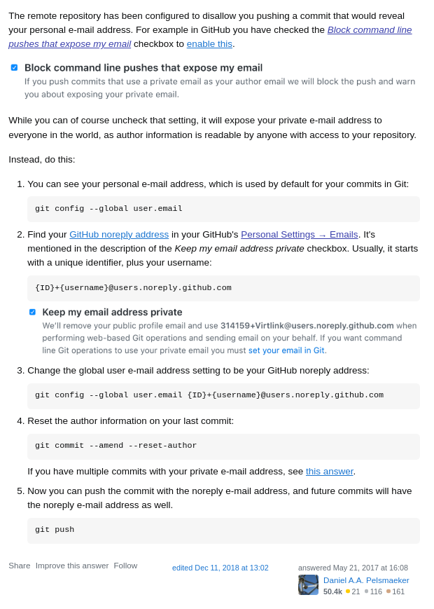

# Solutions

A repository of all the solutions I found (figured) out while solving a problem

## git

1. Meaning of the GitHub message: push declined due to email privacy restrictions

   

   [StackOverflow](https://stackoverflow.com/a/44099011)

## linux

1. `initramfs-tools` error while installing anything on Pop!\_OS

   found this [solution on ask Ubuntu](https://askubuntu.com/questions/1136480/initramfs-error-when-installing-updating), but didn't work for me

   I had to do a fresh install of Pop!\_OS from the recovery mode, because the Refresh option in the settings was also not responding

   to get to `recovery mode` on Pop!\_OS 22.04, turn off the machine, turn on and start hitting the spacebar till you find a boot menu, navigate to Pop!\_OS recovery mode
